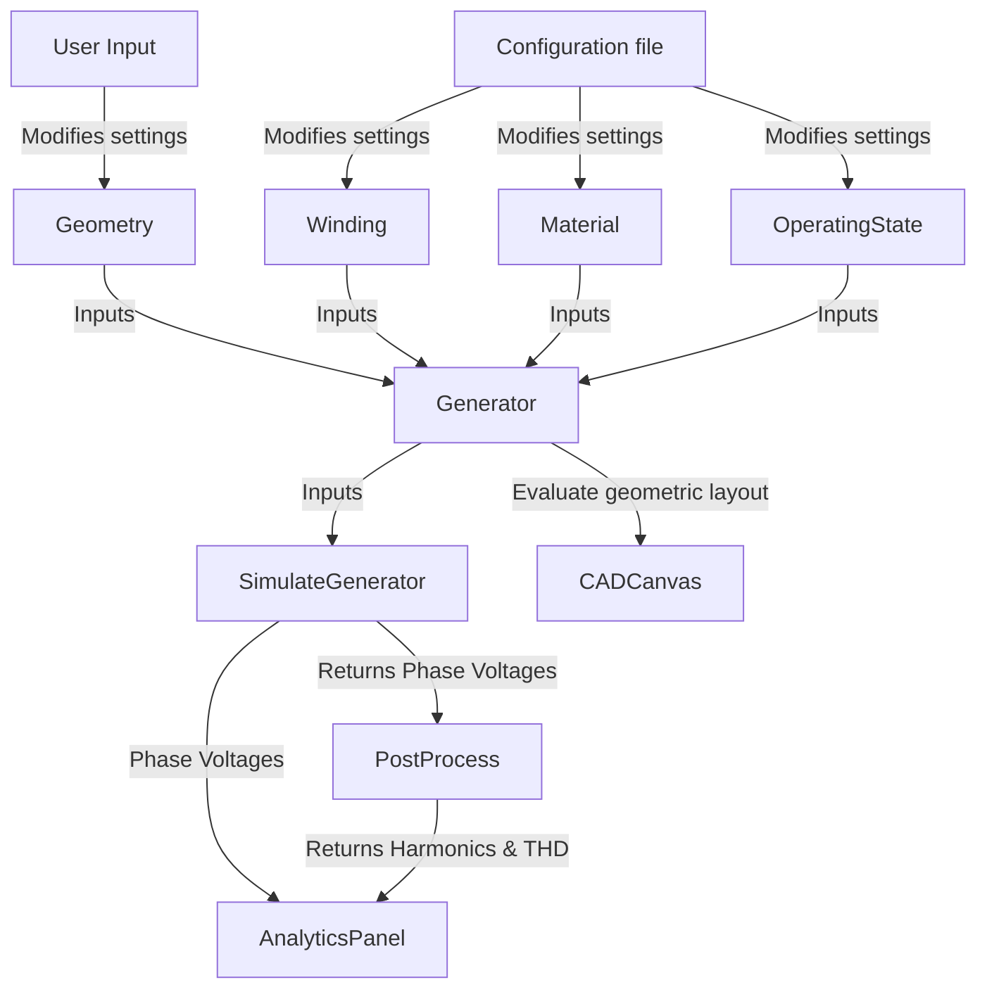

# Generator Winding Visualiser

A modular and educational CustomTkinter application for the simulation, dimensioning, and analysis of electrical generator windings. The tool is designed to teach fundamental electromagnetic, geometric, and electrical principles in generator design through interactive visualisations and real-time signal analysis.

---

## Architecture & Data Flow

The system is built using **Domain-Driven Design (DDD)** principles to separate data from calculation logic and the user interface. This structure prevents code duplication and simplifies automated testing.



### Detailed Data Flow
1. **User Input:** The user configures the physical dimensions (`Geometry`), winding layout (`Winding`), magnetic properties (`Material`), and operation state (`OperatingState`) via the UI.
2. **Simulation Dispatch:** The `Generator` class aggregates the inputs and provides mechanical and electrical properties. `SimulateGenerator` receives the `Generator` model and calculates the induced phase voltages over time.
3. **Post Processing:** The `PostProcess` class analyzes the generated signals, running FFT (Fast Fourier Transform) to extract harmonics and computing Total Harmonic Distortion (THD).
4. **UI Rendering:** The phase voltages and harmonic spectrums are mapped directly to Matplotlib charts. The physical winding layout is drawn in the interactive CAD canvas.

### 1. Domain Models (`src/winding/models/simulation.py`)
* **`Geometry`**: Represents the physical dimensions of the generator (inner diameter, height, airgap, permanent magnet thickness).
* **`Winding`**: Contains the winding configuration, slots, positions, poles, phases, and fill factors.
* **`Material`**: Magnetic material properties (remanence and coercivity).
* **`OperatingState`**: Current runtime parameters (RPM and noise factor).
* **`Generator`**: Aggregates the models and calculates fundamental properties (e.g., electrical frequency, airgap velocity, induced voltage).

### 2. Calculation Engine & Services (`src/winding/models/simulation.py`)
* **`SimulateGenerator`**: Handles the time-domain simulation. Computes net windings per slot, magnetic field patterns, applies noise, and calculates the induced phase voltages over time.
* **`PostProcess`**: Handles frequency-domain analysis. Computes the Fast Fourier Transform (FFT) of the phase voltages to identify harmonics and calculate the Total Harmonic Distortion (THD).

---

## File Structure

The project code is organized inside `src/winding/` as follows:

```text
uu_winding/
├── pyproject.toml              # Dependency management and project configuration (uv/pip)
├── README.md                   # This documentation file
└── src/
    └── winding/
        ├── main.py                 # Application entry point
        ├── models/                 # --- DOMAIN & CALCULATION MODELS ---
        │   ├── simulation.py       # Domain models, simulation engine, and post-processing
        │   └── t.py                # Scratchpad / utility script
        ├── gui/                    # --- CUSTOMTKINTER LAYOUT (MVC) ---
        │   ├── app.py              # Central controller app (coordinates state, callbacks)
        │   ├── console.py          # Left panel (sliders for geometry, winding, and operating state)
        │   ├── canvas.py           # Center panel (interactive blueprint of the generator)
        │   ├── analytics.py        # Right panel (Matplotlib charts for phase voltages and spectrum)
        │   ├── components.py       # Reusable custom widgets
        │   └── theme.py            # Styling themes and font parameters
```

---

## Interface Structure (UI)

The UI is divided into a three-panel workspace in CustomTkinter using an **Event-Driven UI** pattern where panels are decoupled and communicate through the main controller (`app.py`):

1. **Left Panel (`ConsolePanel` / `console.py`)**:
   * Adjusts physical and operational parameters (Geometry, Winding, Material, and State) using interactive inputs and sliders.
2. **Center Panel (`CADCanvas` / `canvas.py`)**:
   * Renders a live CAD-style blueprint of the generator and its winding configuration.
3. **Right Panel (`AnalyticsPanel` / `analytics.py`)**:
   * Displays a warning bar when inputs have changed to prompt a simulation rerun.
   * Houses the "Run Simulation" button.
   * **Phase Voltages Chart**: Plots the simulated time-domain phase voltages of the generator, including noise and the sum of all phases.
   * **Spectrum Chart**: Displays the frequency-domain amplitude spectrum (FFT) to visualize fundamental frequencies and harmonics.

---

## Improvements
Things not yet implemented, which could benefit the program.

### Improve simulation models
* Refine the magnetic field modeling (`magnet` function) for more accurate physical representation.
* Add more metrics in the results
* Add a more realistic way of visualizing the windings
### User Experience (UI) & Features
* **Exporting:** Allow users to export the simulation data (voltages and THD) to a CSV file or report.
* **Save/Load:** Implement local storage so users can save a specific generator configuration and load it later.

---

## Installation and Use

### Installing Python
To use the app and work with it, you need to firstly have installed python. 
* On Mac write `brew install python`. 
* On Windows go to python.org and download python `.exe` file. 
	* Remember to click the **Add python.exe to PATH** button.

**Test results with:**
```
python --version
pip --version
```

### Windows

1. **Create virtual environment:**
   ```powershell
   py -m venv .venv 
   ```

2. **Ensure user privilege to run scripts:**
   ```powershell
   Set-ExecutionPolicy -ExecutionPolicy RemoteSigned -Scope Process
   ```

3. **Activate virtual environment:**
   ```powershell
   .venv\Scripts\Activate.ps1
   ```

4. **Install requirements and package:**
   ```powershell
   pip install -e .
   ```

5. **Run the application:**
   ```powershell
   winding
   # or
   python src\winding\main.py
   ```

### Mac / Linux

1. **Create virtual environment:**
   ```bash
   python3 -m venv .venv 
   ```

2. **Activate virtual environment:**
   ```bash
   source .venv/bin/activate
   ```

3. **Install requirements and package:**
   ```bash
   pip install -e .
   ```

4. **Run the application:**
   ```bash
   winding
   # or
   python src/winding/main.py
   ```

### Dependencies

These packages are used with Python:
* **numpy** (For mathematical calculations)
* **customtkinter** (For GUI)
* **matplotlib** (For plotting datapoints)

---

## Building Executables (PyInstaller)

To package the application into a standalone executable that can run on computers without Python installed, use [PyInstaller](https://pyinstaller.org/).

First, install PyInstaller in your virtual environment:
```bash
pip install pyinstaller
```

Run this command from the project root to build the executable:
```bash
pyinstaller --name "WindingVisualiser" --windowed src/winding/main.py
```

The executable will be located in the `dist/WindingVisualiser/` directory.
