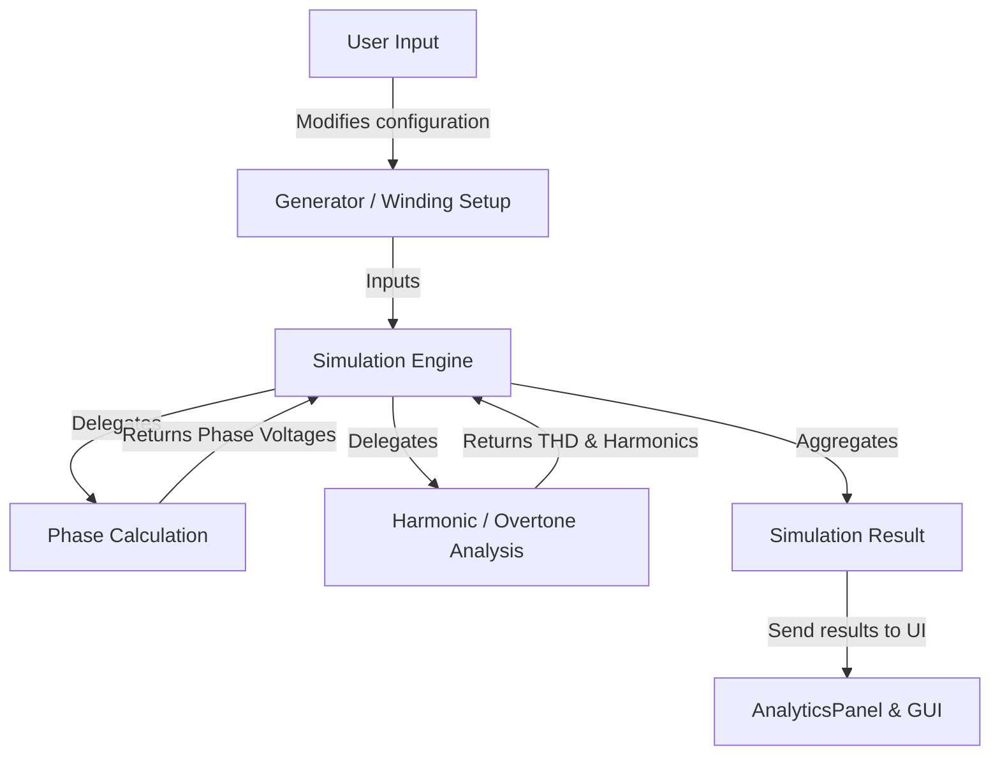

# Generator Winding Simulator

A modular and educational CustomTkinter application for the simulation, configuration, and analysis of electrical generator windings. The tool is designed to teach students fundamental principles in electrical machine design, phase generation, and harmonic (overtone) analysis through interactive visualization.

---

## Architecture & Data Flow

The system is built using principles to separate data from calculation logic and the user interface. This structure prevents code duplication and allows for robust real-time updates.



### Detailed Data Flow
1. **User Input:** The user configures the generator dimensions, magnet setup, RPM, and the physical winding matrix across slots and phases.
2. **Simulation Dispatch:** The simulation engine processes the winding configuration by applying Faraday's law of induction.
3. **Analytics:** The system computes the fundamental frequency, peak voltages per phase, and breaks down overtones (Total Harmonic Distortion - THD).
4. **UI Rendering:** The results are mapped directly to Matplotlib charts (Phase Voltages), tabulated summaries, and the interactive UI components.
5. **Exporting:** Results, charts, and the winding matrix can be exported to CSV, TOML, and PDF reports.

---

## File Structure

The project code is organized inside `src/winding/` as follows:

```text
uu_winding/
├── README.md                   # This documentation file
├── build.py                    # Build script for PyInstaller obfuscation
└── src/
    └── winding/
        ├── main.py                 # Application entry point
        ├── config.py               # Central physical and UI constants
        │
        ├── models/                 # --- DOMAIN & CALCULATION MODELS ---
        │   ├── generator.py        # Generator state and core abstractions
        │   ├── simulation.py       # Math engine for calculating voltages and phase properties
        │   └── export.py           # Logic for PDF, CSV, and TOML generation
        │
        ├── gui/                    # --- CUSTOMTKINTER LAYOUT (MVC) ---
        │   ├── app.py              # Central controller app 
        │   ├── components.py       # Reusable custom widgets
        │   ├── analytics.py        # Analytics panel with charts and tables
        │   ├── language.py         # i18n Translation manager (English/Swedish)
        │   └── theme.py            # Styling themes and UI colors
        │
        └── assets/                 # External assets (icons, localization TOMLs)
```

---

## Interface Structure (UI)

The UI is divided into panels managed by the main application controller (`app.py`):

1. **Configuration Panel**:
   * Adjust generator settings like RPM, Poles, Slots, and Phases.
   * Input the interactive **Winding Matrix** representing positive and negative phase coils in different slots.
2. **Analytics & Results Panel**:
   * **Phase Voltages Over Time**: Matplotlib plot showcasing the resulting sine waves.
   * **Windings Breakdown**: Table detailing total up and down windings per phase.
   * **Harmonics Table**: Breakdown of 1st, 3rd, 5th, and 7th harmonics, alongside the Total Harmonic Distortion (THD) and averages.
3. **Export Features**:
   * One-click "Export" to generate a `.zip` archive containing `report.pdf`, `winding_matrix.csv`, phase data, and `results.toml`.

---

## Installation and Use

### Installing Python
To use the app and work with it, you need to first install Python. 
* On macOS write `brew install python`. 
* On Windows go to python.org and download the Python `.exe` file. 
	* Remember to click the **Add python.exe to PATH** button.

**Test installation with:**
```bash
python --version
pip --version
```

### Windows

1. **Create virtual environment (For holding packages):**
   ```powershell
   py -m venv .venv 
   ```

2. **Ensure user privilege to run scripts:**
   ```powershell
   Set-ExecutionPolicy -ExecutionPolicy RemoteSigned -Scope Process
   ```

3. **Activate virtual environment:**
   ```powershell
   .venv\Scripts\Activate.ps1
   ```

4. **Install requirements:**
   ```powershell
   pip install -r requirements.txt
   pip install -e .
   ```

5. **Run the application:**
   ```powershell
   python src\winding\main.py
   ```

### Mac / Linux

1. **Create virtual environment:**
   ```bash
   python3 -m venv .venv 
   ```

2. **Activate virtual environment:**
   ```bash
   source .venv/bin/activate
   ```

3. **Install requirements:**
   ```bash
   pip install -r requirements.txt
   pip install -e .
   ```

4. **Run the application:**
   ```bash
   python src/winding/main.py
   ```

### Dependencies

Key packages used:
* **numpy** / **scipy** (Mathematical and matrix calculations)
* **customtkinter** (Modern GUI toolkit)
* **matplotlib** (Data visualization)

---

## Building Executables (PyInstaller)

To package the application into a standalone executable that can run on computers without Python installed, use [PyInstaller](https://pyinstaller.org/).

**Important:** To get the binaries required for each operating system, the build command must be run on that specific operating system (Windows for `.exe`, macOS for `.app`, Linux for binary).

First, install PyInstaller and PyArmor in your virtual environment:
```bash
pip install pyinstaller pyarmor
```

To build, simply run the included `build.py` script from the project root. This script will automatically obfuscate the code using PyArmor, bundle required assets, and package it using PyInstaller into a standalone executable.

```bash
python build.py
```

The executable will be located in the `dist/` directory.
